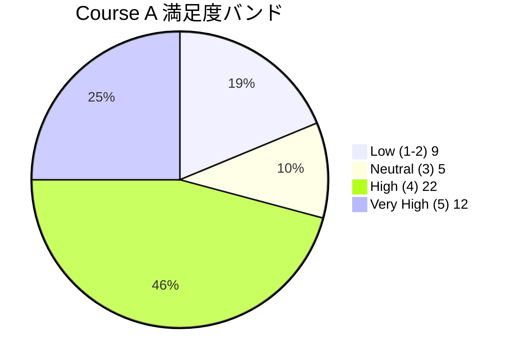
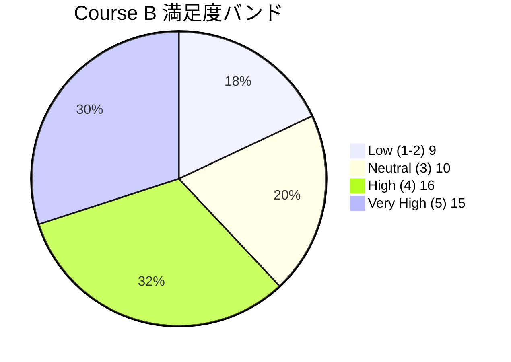
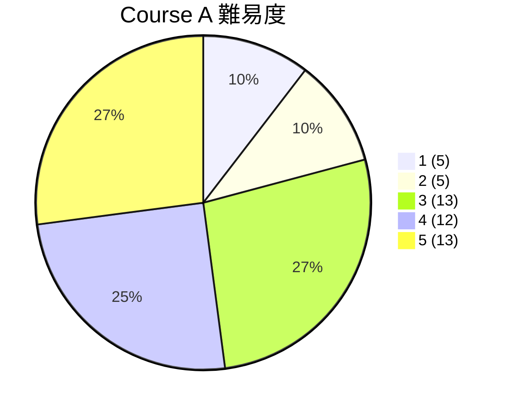
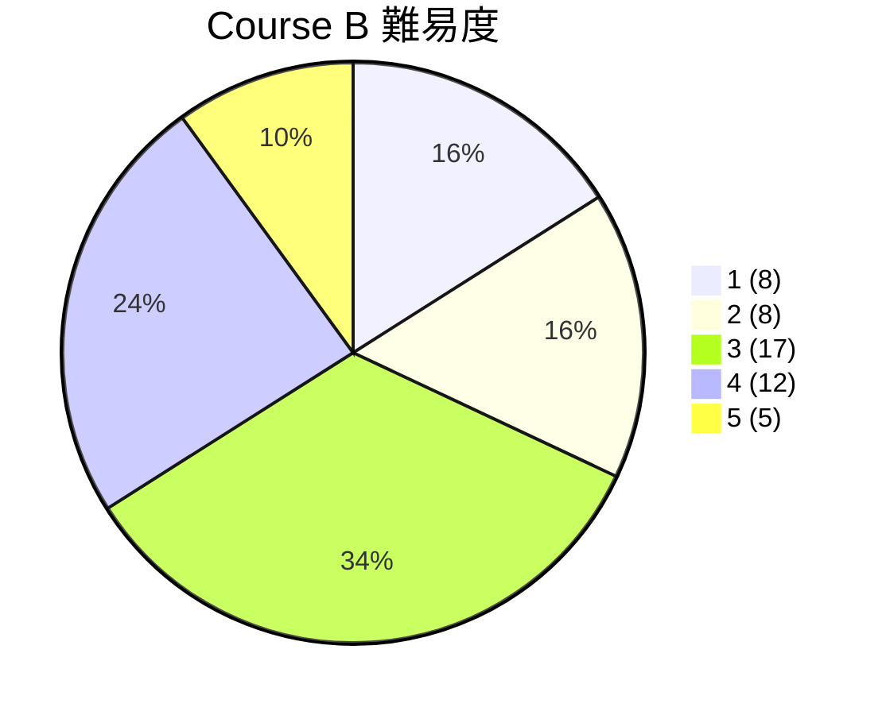
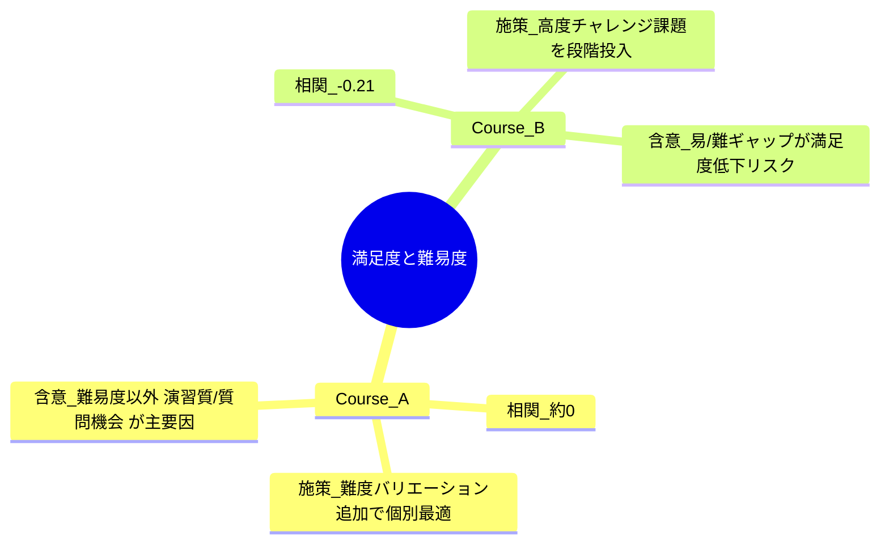
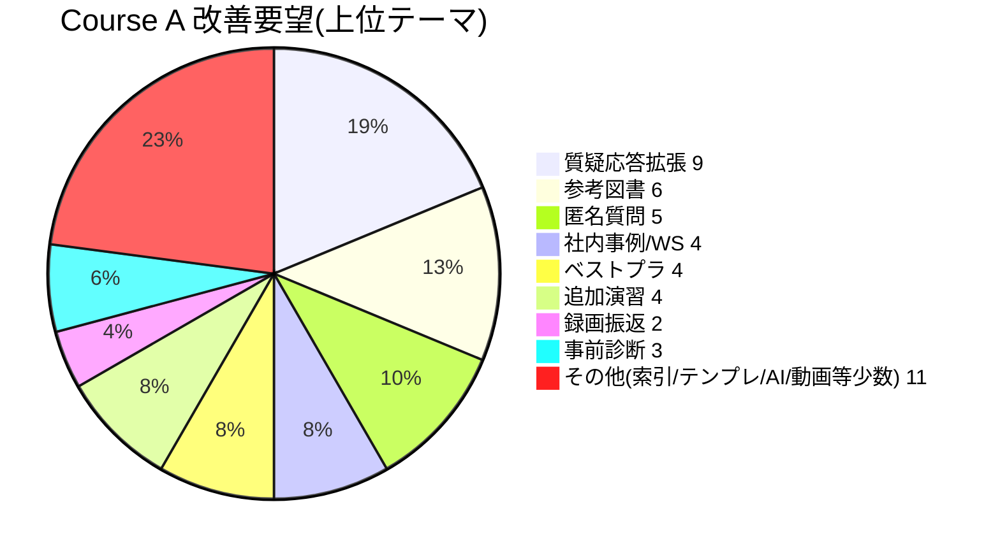
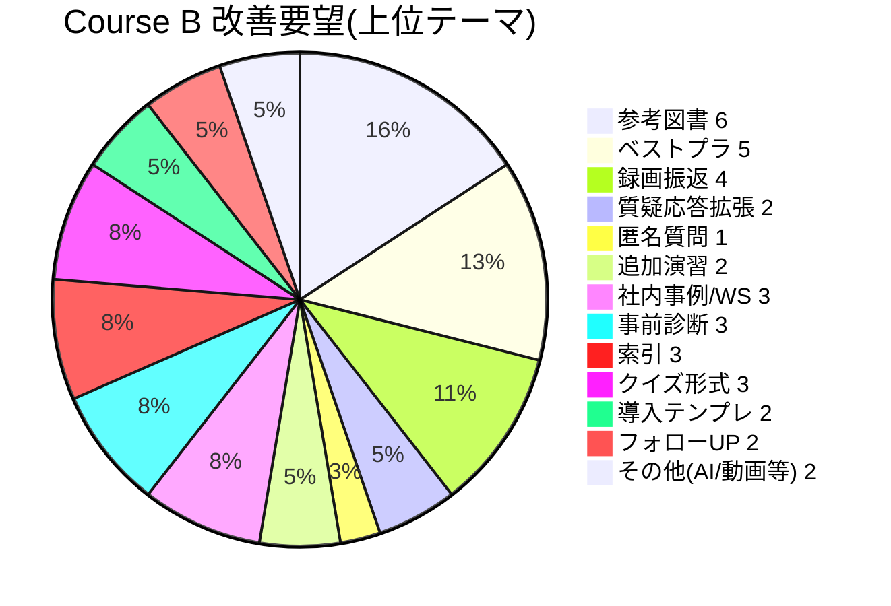
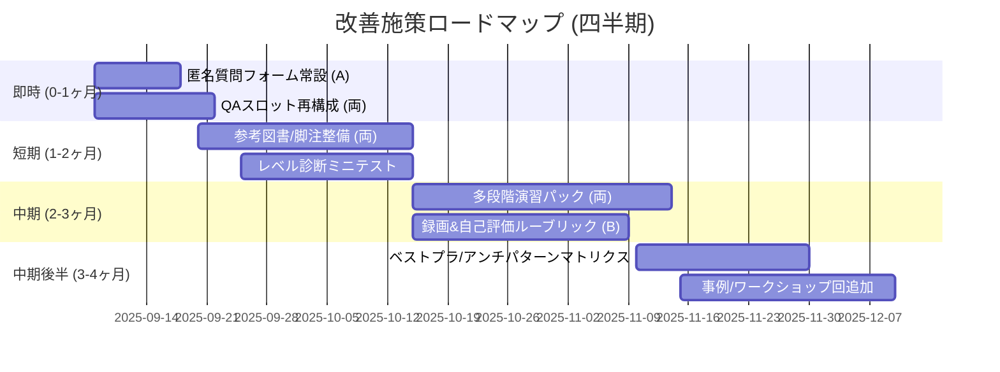

# 最新2講座アンケート多角的分析レポート

対象講座: 
1. プレゼンテーションスキル向上研修 (開催: 2025-08-30) — 以下 Course A
2. Excelデータ分析実践講座 (開催: 2025-08-21) — 以下 Course B

データ件数: A=48, B=50 （満足度(s) / 難易度(d) / 改善要望テキスト）

---
## 1. 集計サマリ

| 指標 | Course A (満足度) | Course B (満足度) | Course A (難易度) | Course B (難易度) |
|------|------------------|------------------|------------------|------------------|
| 件数 n | 48 | 50 | 48 | 50 |
| 平均 | 3.71 | 3.68 | 3.48 | 2.96 |
| 中央値 | 4 | 4 | 4 | 3 |
| 最頻値 | 4 | 4 | 3 | 3 |
| 標準偏差 | 1.15 | 1.19 | 1.27 | 1.20 |
| 相関 (満足度 vs 難易度) | -0.018 (ほぼ無相関) | -0.205 (弱い負の相関) | – | – |

解釈:
- 両講座とも満足度平均は概ね同水準 (3.7 付近) で中央値4 → 「概ね満足」層が中心。
- 難易度は A の方が高め (平均3.48 vs 2.96) で、B は易しめ評価が多い。
- B では難易度が高まると若干満足度が下がる傾向（弱い負の相関）。A は難易度と満足度が独立的にばらつく構造。

---
## 2. 満足度分布 (バンド: 1-2 Low, 3 Neutral, 4 High, 5 Very High)





所見:
- A は「High=4」が過半近く (46%)。B は Very High(5) がやや多く最上位満足層が厚い。
- B は中立(3) が A より多く “尖りの少ない” 評価曲線。

---
## 3. 難易度分布比較 (互換表示)

Mermaid の `bar` 図は環境によって未サポートのため、代替として pie と疑似横棒 (graph) を併記。

### 3-1. 難易度分布 Pie (各講座)



### 3-2. 疑似横棒 (文字幅による簡易比較)
```
Course A 1: █████ (5)
Course A 2: █████ (5)
Course A 3: █████████████ (13)
Course A 4: ████████████ (12)
Course A 5: █████████████ (13)

Course B 1: ████████ (8)
Course B 2: ████████ (8)
Course B 3: █████████████ (17)
Course B 4: ████████████ (12)
Course B 5: █████ (5)
```

解釈（不変）:
- A は難易度 4-5 が 25/48 (52%) と高難度寄りの二峰 (3 と 5)。
- B は 1-2 が 16/50 (32%)、3 が最多 (34%) で中〜易寄り。難易度設計差が顕著。

---
## 4. 満足度×難易度 関係概念図
（相関係数の差異と教育設計示唆）



---
## 5. 改善要望テーマ頻度

抽出した代表テーマ (正規表現ベース) の出現回数。上位ニーズを可視化。




（注）複数テーマを集約し円グラフ化。細分類の横比較は表形式で補完可能。

要約:
- 共通して「質疑応答時間拡張」「参考図書/補足資料」「ベストプラクティス/アンチパターン」「社内事例・ワークショップ」「追加演習」ニーズが高い。
- A 特有: 匿名質問ボックス需要が B より顕著 (5 vs 1)。
- B 特有: 録画/ロールプレイ振り返り (4)・フォローアップ (2) が存在感。

---
## 6. ギャップ分析 (Needs vs 現状示唆)

| テーマ | 共通性 | 現状課題 | 推奨施策(優先度) |
|--------|--------|----------|------------------|
| 質疑応答拡張 | 両方高 | セッション末集中低下 | 時間スロット延長+途中ミニQA (高) |
| 参考図書/補足脚注 | 両方高 | 発展学習導線不足 | 段階別リソースパック (高) |
| 社内事例/WS | 中 | 実務転用ブリッジ不足 | 事例共有ワーク回新設 (中) |
| ベストプラクティス/アンチパターン | 中 | 具体抽象行き来負荷 | 典型パターンマトリクス配布 (中) |
| 追加演習/チャレンジ課題 | 中 | レベル差調整未最適 | 難易度3段階演習セット (中) |
| 匿名質問ボックス (A) | A特有高 | その場で質問しづらい層 | 匿名フォーム常設 & FAQ化 (高:A) |
| 録画/ロールプレイ振返 (B) | B特有 | 内省機会不足 | 演習録画 & 自己評価ルーブリック (中:B) |
| 事前診断/レベル分け | 両方一部 | ミスマッチ受講発生 | 事前ミニ診断→推奨トラック表示 (高) |
| 索引/検索性 | B寄り | 再参照コスト高 | スライド末尾索引/用語集 (低〜中) |

---
## 7. リスク・機会

| 観点 | Course A | Course B | 共通機会 |
|------|----------|----------|-----------|
| 難易度適合 | 高低混在 (分散大) → 個別最適不足 | 易〜中集中 | アダプティブ課題導入 |
| 高満足層育成 | High/VeryHigh=70.8% | High/VeryHigh=62% | ロイヤル層事例化で営業資料化 |
| 改善優先 | 匿名質問, 質疑応答 | 難易度差別化, 録画振返 | 追加演習・参考図書共通強化 |

---
## 8. 推奨アクションロードマップ



---
## 9. KPI 提案 (改善効果測定)

| KPI | 定義 | 基準値(現状) | 目標 (次回サイクル) | 計測方法 |
|-----|------|--------------|----------------------|-----------|
| 満足度平均 | s の平均 | A:3.71 / B:3.68 | 3.9 以上 | アンケ集計 |
| High以上割合 | (4+5)/n | A:70.8% / B:62% | A:75% / B:68% | 集計スクリプト |
| 不満層割合 | s<=2 | A:18.8% / B:18% | 15% 以下 | 同上 |
| 参考資料活用率 | 追加資料DL/受講者 | – | 60% | LMSログ |
| 質問数/受講者 | QA投稿総数/n | – | +30% | フォーム/チャットログ |
| 演習完遂率 | 完遂受講者/n | – | 85% | 提出管理 |

---
## 10. まとめ

両講座とも満足度は安定して高いが、難易度設計とフォロー手段(質問/補足資料/演習多段化)を最適化する余地がある。特に Course B は易しめ評価が一部満足度伸長を阻害、Course A は難易度と満足度が独立→個別化施策が差別化要因。共通ニーズ上位（質疑応答拡張・参考資料充実・追加演習）を即時着手し、匿名質問 (A) と録画振返 (B) を講座別強化ポイントとして差分最適化を図ることが推奨される。

---
出力生成日時: 2025-09-07

（本レポートは自動スクリプト集計 + ルールベーステキスト抽出により生成）
